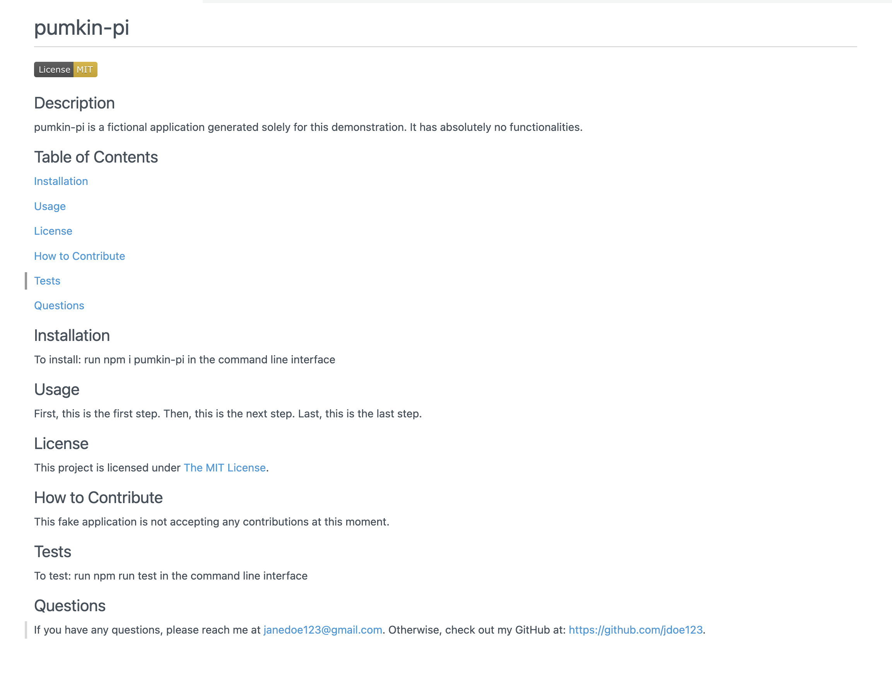

# README Generator


## Description
This application produces README documents for applications based on user inputs to prompts. It is a much quicker and easier process, so developers can devote more time to working on the project.

## Installation
1. Download the repository by running ```git clone <SSH key>``` in the command line interface.
2. Install inquirer version 8.2.4 by running ```npm i inquirer@8.2.4``` in the command line interface.

## Usage
After installing, run ```node index.js``` in the command line interface. Then, answer the prompts. When all the prompts are answered, a new README will be generated with the name ```GENERATED-README.md```.

> Note: This README generator does not completely guarantee a high-quality README. Make sure you still read through the file and make edits when necessary!

### Link to video walkthrough
https://drive.google.com/file/d/1vlR52B0xTNpFICiA0p19flgHEqs9wQJq/view?usp=share_link

### Screenshot of sample README generated in video walkthrough


Click [here](./GENERATED-README.md) to see the document.

## Credits

### Resources Accessed
* Lukas Himsel (https://github.com/lukas-h) Markdown License Badges: https://gist.github.com/lukas-h/2a5d00690736b4c3a7ba

## License
This repository is licensed under the [MIT License](https://opensource.org/licenses/MIT).